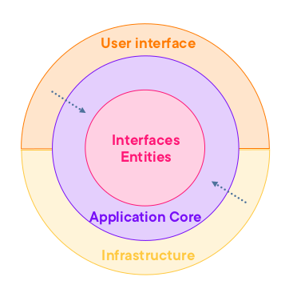
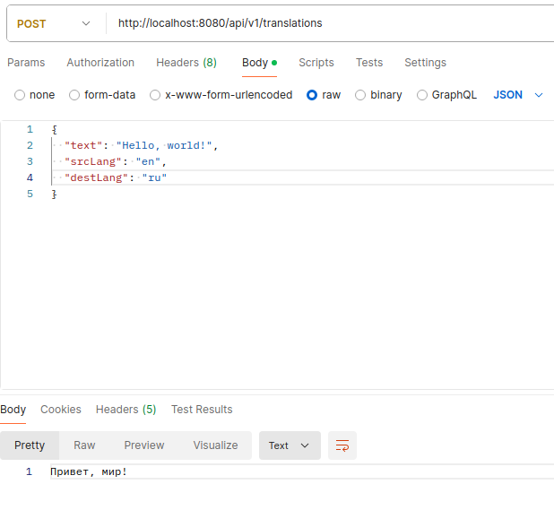
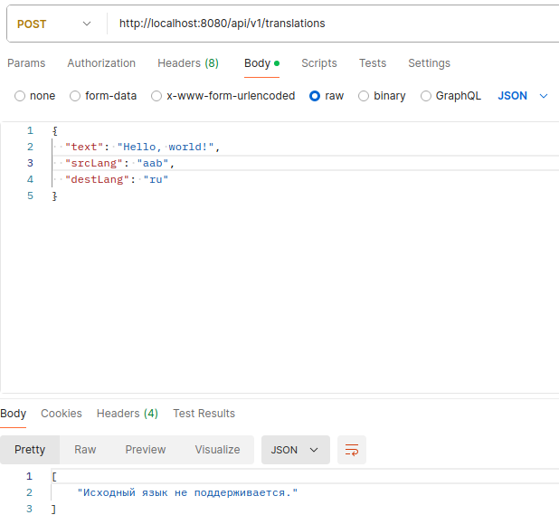
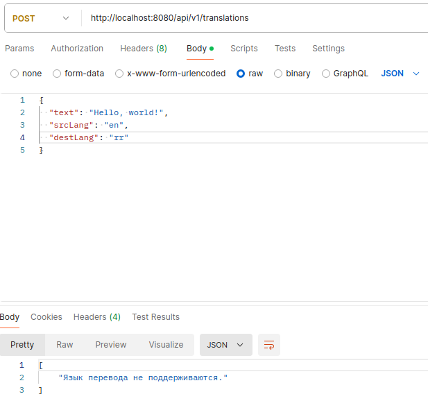
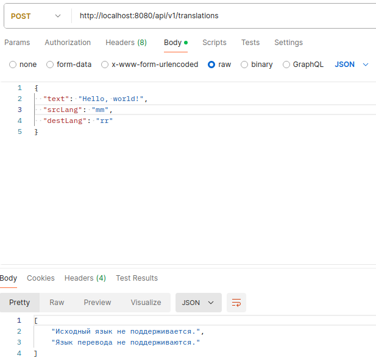
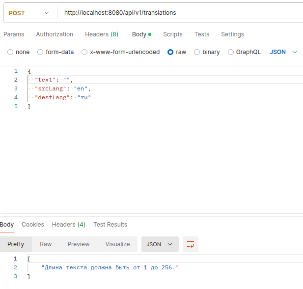
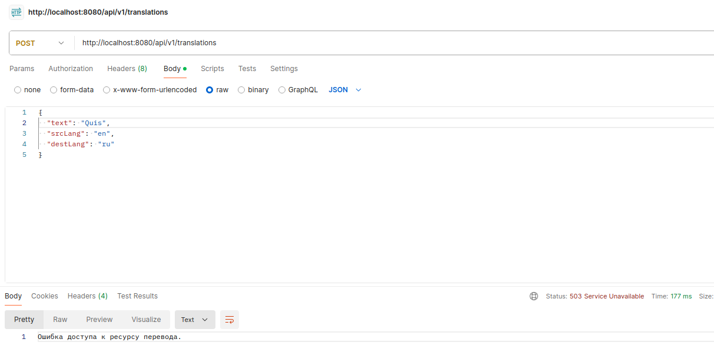
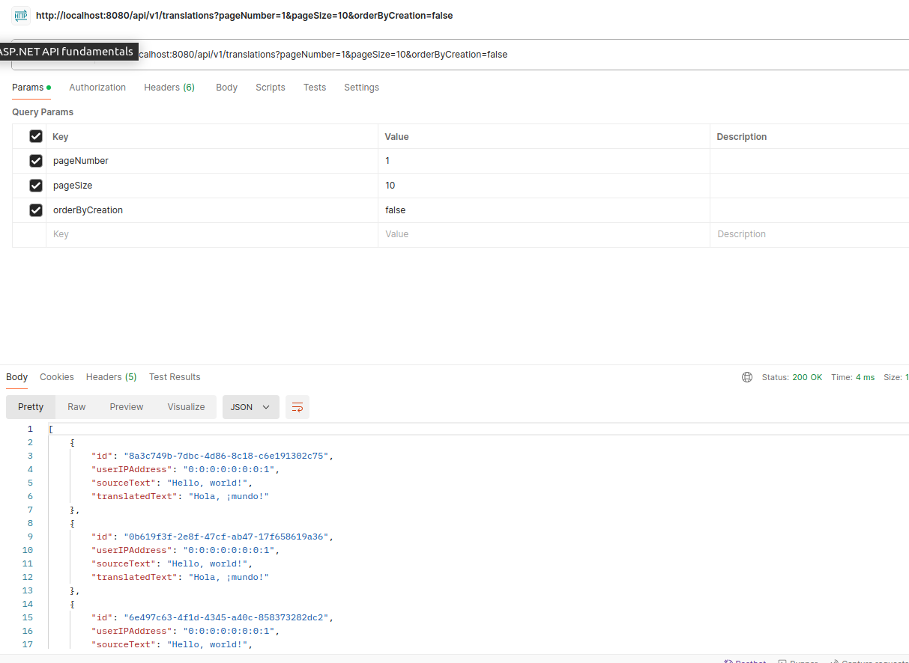
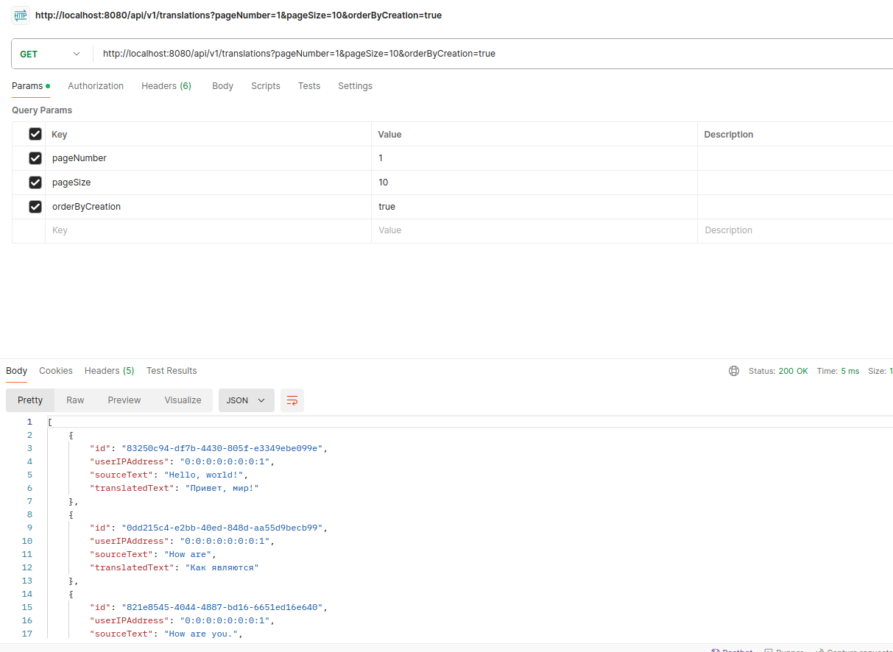
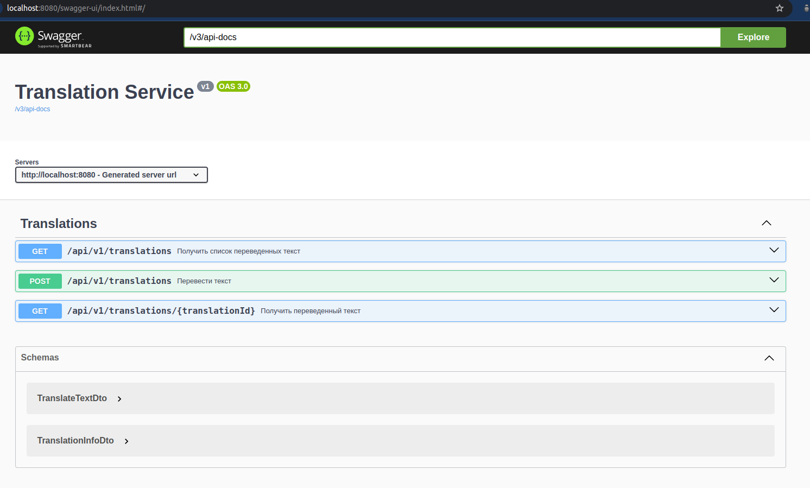

# Лабораторная работа по Java

### 1 задание

Вам необходимо разработать веб-приложение на языке Java/Kotlin для перевода набора слов на другой язык с использованием стороннего сервиса перевода (Яндекс, Google или др.).

Требования к программе:

* Приложение должно принимать на вход строку, состоящую из набора слов, исходный язык и целевой язык в качестве параметров для перевода. В ответе программа должна вернуть переведенную строку.
* Каждое слово должно быть переведено отдельно в нескольких потоках. При этом число одновременно работающих потоков не должно превышать 10.
* Приложение должно сохранять в реляционную базу данных информацию о запросе: IP-адрес пользователя, входную строку для перевода и результат перевода. Структуру хранения нужно придумать самостоятельно.
* Код программы должен быть выложен на github и содержать readme — инструкции по запуску приложения и как его использовать.

Дополнительные требования:

* Можно использовать фреймворк Spring/SpringBoot
* Для базы данных использовать только JDBC
* Для вызова внешней системы использовать RestTemplate

Пример:

Вход

en → ru

Hello world, this is my first program

Выход

Пример 1: http 200 Привет мир, это является мой первый программа

Пример 2: http 400 Не найден язык исходного сообщения

Пример 3: http 400 Ошибка доступа к ресурсу перевода

Решения задания будут проверяться вручную, поэтому будет уделено внимание не только функциональности, но и технике программирования (структурирование кода, стиль, тестирование и т.д.). Постарайтесь использовать лучшие практики при подготовке решения.

В качестве ответа прикрепите ссылку на github с итоговым решением. Не забывайте положить в readme инструкцию по запуску.

### Реализация

---

При разработке и проектировании проекта применялась идеология чистой архитектуры с шаблоном CQRS.

Для перевода текста используется API от [RapidAPI](https://rapidapi.com/). В документации [Google Translate API](https://cloud.google.com/translate/docs/reference/rest) написано, что перевод по словам может содержать ошибки, так как при переводе полного текста используются алгоритмы нейронных сетей, и переведенный текст получается намного ближе к оригиналу. Но так как в задании было указано, что нужно применить несколько потоков и переводить каждое слово отдельно, для каждого слова отправляется отдельный запрос к серверу, и в конце все слова собираются в текст.

Для работы API в файле [application.yaml](https://github.com/ak-karimzai/TranslationService/src/main/resources) необходимо заменить ключ (key), чтобы можно было отправлять запросы для получения перевода текста.

Данные запроса хранятся в PostgreSQL с помощью API JDBC.

Пример запроса для перевода текста выглядит следующим образом:

Пример запроса, когда исходный язык не существует (ошибка 400):

Пример запроса, когда язык перевода не существует (ошибка 400):

Пример запроса, когда исходный язык и язык перевода не существуют (ошибка 400):

Пример запроса, когда пользователь пытается перевести пустой текст (ошибка 400):

Пример запроса, когда сервис недоступен (ошибка 503):

Дополнительно добавлены две другие конечные точки в API, чтобы можно было получить историю переводов. При получении списка истории можно подавать URL параметр `orderByCreation=true`, тогда результаты будут сортироваться по дате создания.

Пример получения списка истории переводов:

Пример получения списка истории переводов, отсортированного по дате создания:

Также можно получить доступ к API с помощью Swagger-UI. Пример Swagger документации API:
